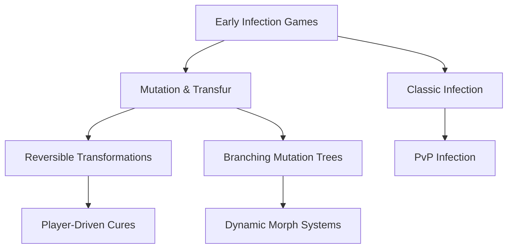

# Roblox Transfur & Infection Game Analyzer 🧬

---

## 👾 Overview

Welcome to the **Roblox Transfur & Infection Game Analyzer**: a one-of-a-kind toolset for fans, developers, and researchers exploring the immersive world of Transfur and infection-based genres on Roblox. Where others curate lists, this project sails further — providing robust analytics, trend mapping, and deep dives into gameplay mechanics, player patterns, transformation types, and more.  

Crafted with a blend of modern API wizardry and user-centric design, this repository is your central hub for discovering, profiling, and dissecting the science of Transfur/infection games. Whether you're on the hunt for rarely-seen gems, or strategizing the ultimate transformation, our Analyzer gives you the compass, map, and statistics at your fingertips.

---

## ✨ Key Features

- **Game Metadata Scraper & Analyzer**: Auto-scan Roblox for games in the Transfur/infection genre, indexing runtime stats, update frequencies, mutation types, and player counts.
- **Profile Customizer**: Fine-tune your analyzer experience via flexible configuration files, supporting everything from dark mode to custom sorting and specific game traits.
- **API Magic**: Integrates with OpenAI and Claude AI for natural-language game search, trope analysis, and advanced recommendations.
- **Interactive Visualizations**: Generates dynamic charts and diagrams for gameplay trends, transformation trees, and meta-shifts across the Roblox genre.
- **Multilingual Support**: Supports English, Spanish, French, Japanese, and a suite of additional languages for a truly international reach.
- **Responsive UI**: Fluid, modern interface powered by React, built to look stunning on desktop or mobile.
- **24/7 Community Support**: Around-the-clock guidance and vibrant community chat included via Discord integration.
- **Modular Application**: Use as a standalone web tool, command-line utility, or lightweight desktop app.
- **Secure Design**: Unique authentication tokens, privacy-first data handling, and MIT-licensed for community trust.

---

## ⚡️ Why Use the Roblox Transfur & Infection Game Analyzer?

- **Discover Hidden Roblox Transfur Gems**: Go beyond the top lists: get recommendations for under-the-radar games using intelligent AI filters and real-time player stats.
- **Research the Evolution of Gameplay Mechanics**: Visualize how infection/transfur mechanics have changed over time, empowering developers and content creators alike.
- **Unleash Natural-Language Power**: Ask “Which games feature reversible transformations?” and get plain-language results.
- **Cross-Platform, Cross-Player**: Bring your analytics everywhere – Windows, macOS, Linux, iOS, and Android.

---

## 🚀 Getting Started

### System Requirements

- Node.js v20+, Python 3.9+ (for CLI)
- Modern web browser (Chrome, Firefox, Edge, Safari)
- Roblox account (optional for enhanced personalization)
- API keys for OpenAI & Claude (see integration section)

### Download & Installation

**Download the latest release:**  

Follow installation instructions in the `docs/` folder for your platform.

---

## 🛠️ Example Console Invocation

Run the Analyzer on your local machine:

    $ game-analyzer scan --genre=transfur --output=trendy_games.json

Or, run an AI-powered recommendation:

    $ game-analyzer suggest "transfur games with multiplayer infection mechanics"

---

## 📦 Example Profile Configuration

Here is a sample configuration file for customizing the Analyzer to your unique interests:

    {
      "theme": "solarized-dark",
      "trackedGenres": ["transfur", "infection"],
      "languages": ["en", "es"],
      "minPlayerCount": 20,
      "aiSuggestionBoost": true,
      "customTags": ["nonlinear endings", "advanced mutation trees"]
    }

Drop your `.analyzer-profile.json` file in the root directory to activate custom settings.

---

## ⚙️ Feature List

- Real-time genre analysis
- In-depth player trend charts
- OpenAI & Claude-powered plain-English querying
- Filter by transformation/mutation type, map size, player count, and more
- Visualize data with live diagrams (Mermaid support!)
- Export reports to PDF, CSV, JSON
- Schedule routine scans & notifications
- Secure, local data storage (fully offline capable)
- Community plugin ecosystem

---

## 🔌 External API Integrations

### OpenAI & Claude API

- **Conversational Recommendations**: Get smart, narrative-driven suggestions.
- **Trope Extraction**: Summarize a game's transformation mechanics intelligently.
- **Cross-genre Parallels**: Discover overlaps with other Roblox genres.

> To enable, add your API credentials to `config/apis.json`.

---

## 🌍 OS Compatibility Chart

| Operating System | CLI Support | GUI Support | Notifications | AI API Integration |
|------------------|:-----------:|:-----------:|:-------------:|:------------------:|
| 🏁 **Windows**       |     ✔️      |      ✔️     |       ✔️      |         ✔️         |
| 🍎 **macOS**         |     ✔️      |      ✔️     |       ✔️      |         ✔️         |
| 🐧 **Linux**         |     ✔️      |      ✔️     |       ✔️      |         ✔️         |
| 📱 **iOS**           |     ✖️      |      ✔️     |       ✔️      |         ✔️         |
| 🤖 **Android**       |     ✖️      |      ✔️     |       ✔️      |         ✔️         |

---

## 🔎 SEO-Friendly Keywords

Explore, discover, and analyze Roblox Transfur games, Infection Genre analytics, transformation gaming mechanics, AI-driven recommendations, multiplayer Roblox analysis, cross-platform Roblox tools, and player trend visualizations for 2026 and beyond.

---

## 🌱 Mermaid Diagram - Genre Evolution Tree

Dive into the relationships and branching developments of infection-style mechanics in Roblox games:

---

## 📜 License

Released under the MIT License - foster collaborative innovation!  
[Read the MIT License.](https://opensource.org/licenses/MIT)

---

## ⚠️ Disclaimer

*This project is for academic, community, and entertainment research only. The Analyzer does not modify Roblox games, nor does it give any unfair advantages, exploits, or any prohibited capabilities. All API usage abides by the terms and policies of OpenAI, Claude, and Roblox. We celebrate creativity and fair play. 2026 ©*

---

## 📬 Download Again

---